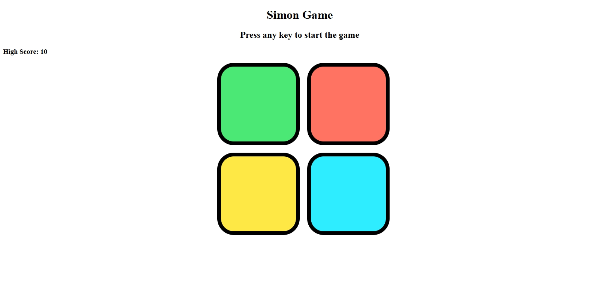

# Simon Game

A web-based implementation of the classic **Simon memory game**, built using **HTML**, **CSS**, and **JavaScript**.  
The goal is simple: **repeat the sequence of lights** as it gets progressively longer.  

## Features
- **Dynamic Levels** – Sequence grows every round.
- **Flash & Click Animations** – Visual feedback for both system and user inputs.
- **High Score Tracking** – Highest score is saved using `localStorage`.
- **Responsive Layout** – Works on different screen sizes.

## How to Play
1. **Press any key** to start the game.
2. Watch the sequence of button flashes.
3. **Click the buttons** in the same order.
4. Each round adds a new step to the sequence.
5. **Game over** if you press the wrong button.  
   - Your score will be displayed.
   - The **high score** will update if you beat your previous best.

## File Structure
```
├── index.html # Main HTML structure
├── style.css # Styling for layout and animations
├── app.js # Game logic and interactions
```
## Screenshots
  

## Future Enhancements
- Add **sounds** for each button press.
- Add a **difficulty mode** (faster sequence).
- Include a **reset button** for clearing high scores.

## Setup
1. Clone or download this repository.
2. Open `index.html` in your browser.
3. Play and enjoy!

---

**Created by:** [Shivansh Gupta](www.linkedin.com/in/shivansh-gupta017)  
